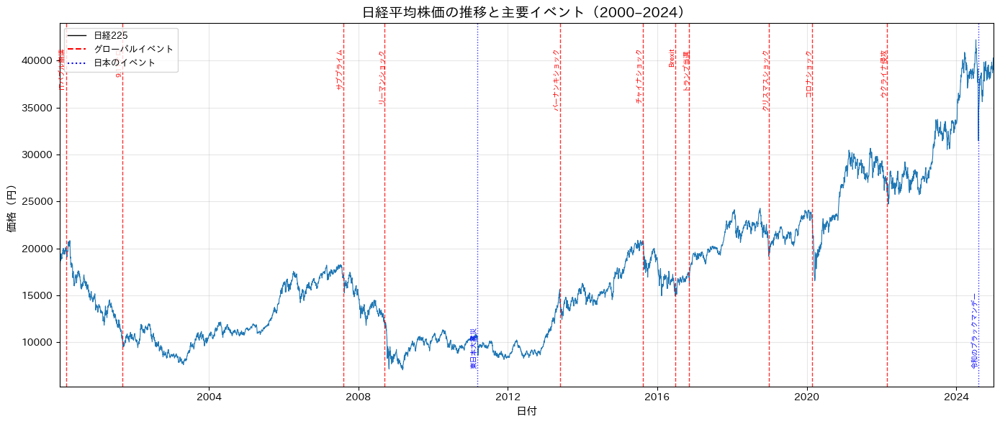
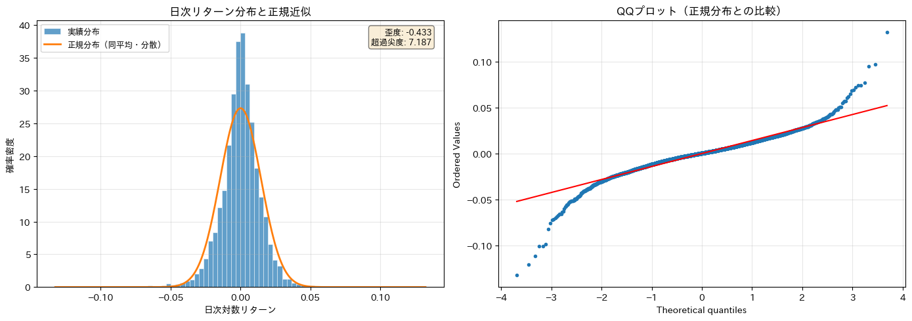
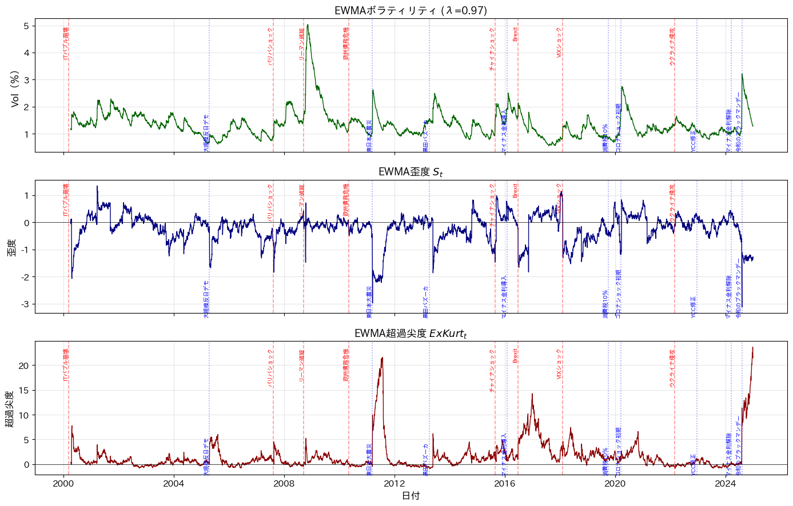
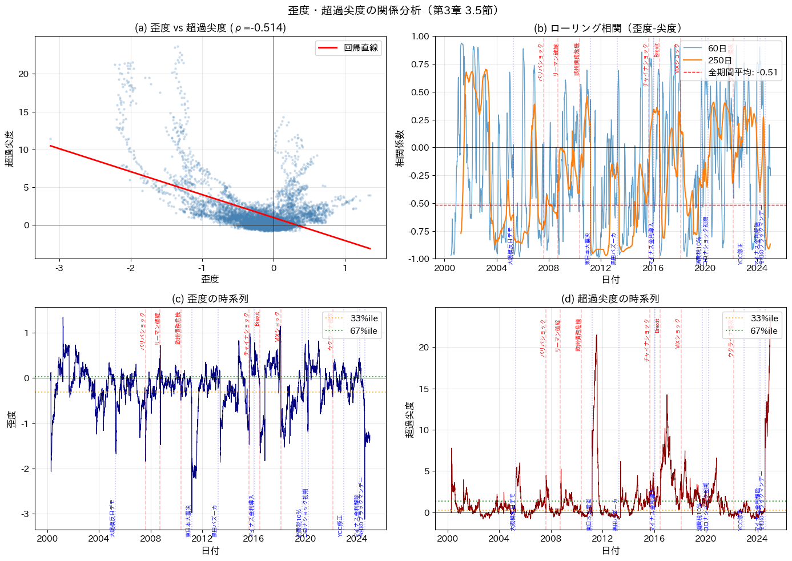
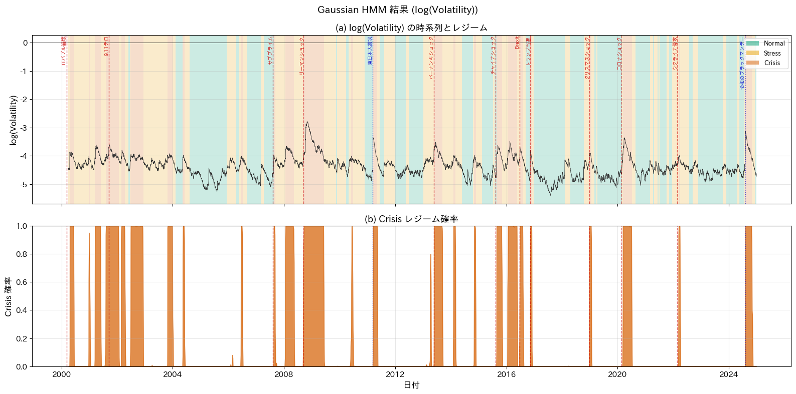
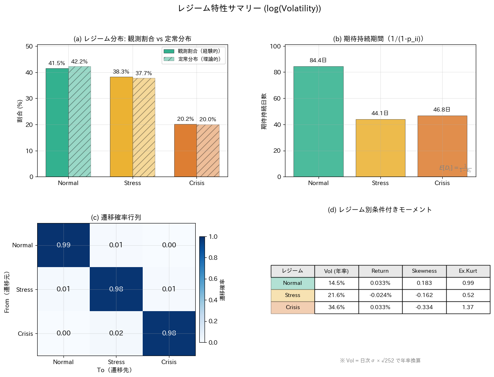
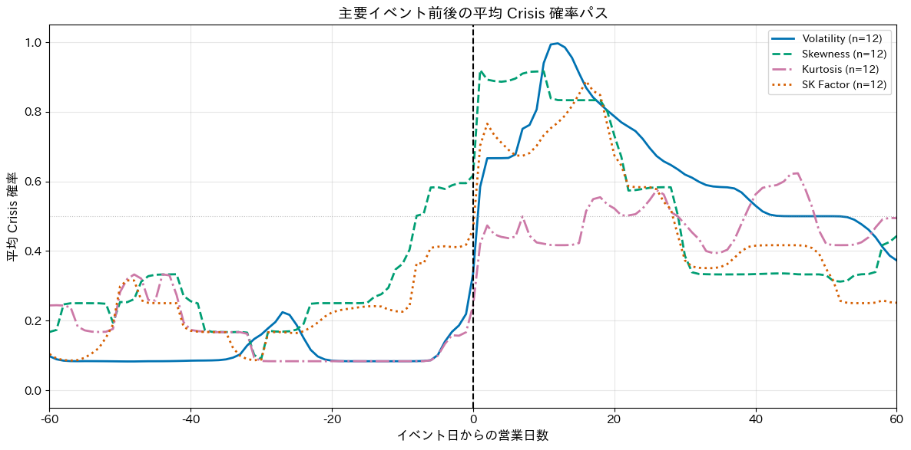
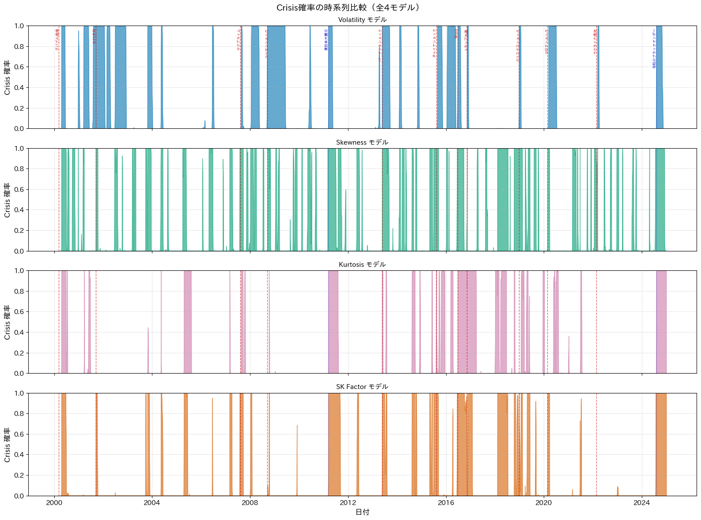
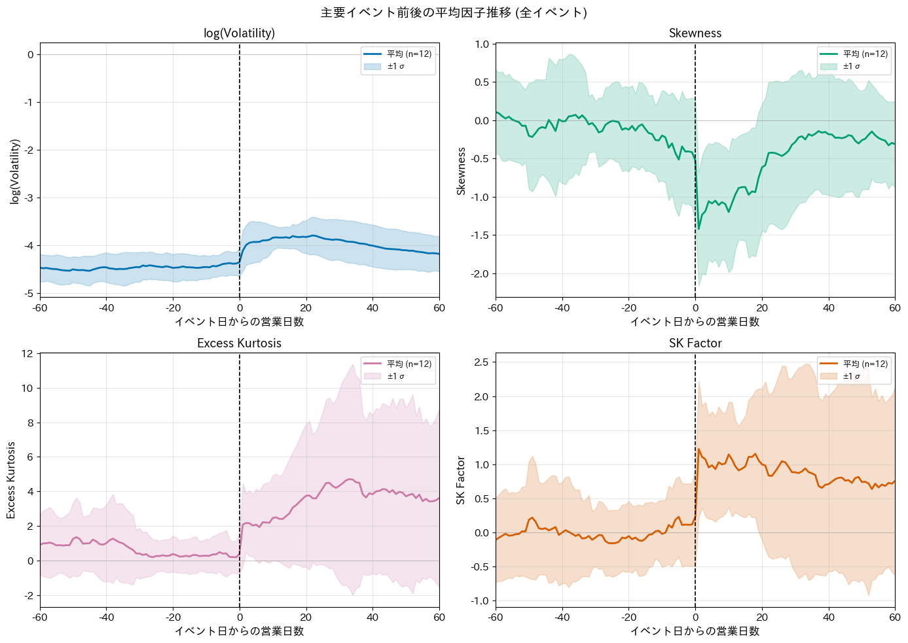

# EWMA 高次モーメントと Gaussian HMM による市場レジーム識別

### 日経225における分布形状ダイナミクスと危機検知の多面的分析


-lightgrey)

> 経済学部・演習論文（ゼミナール研究）。ボラティリティだけでは捉えられない「分布の形」の変化に着目し、日経225の25年間を **Normal / Stress / Crisis** の3レジームに分類、危機の検知能力を4つの指標で比較しました。

---

## 概要 (Overview)

従来の金融リスク管理では、リスクの大きさを測る指標として主に **ボラティリティ（分散）** が使われてきました。しかし金融危機時にはリターン分布が正規分布から乖離し、極端な値が頻出する **ファットテール現象** が観測されます。ボラティリティの監視だけでは、こうした市場の潜在的な脆弱性を捉えきれない可能性があります。

本研究では、分布の形状を示す **歪度 (Skewness)** と **尖度 (Kurtosis)** という2つの高次モーメントに着目します。**EWMA（指数加重移動平均）** の枠組みを高次モーメントへ拡張して時変な危機因子を構成し、**単変量 Gaussian HMM（隠れマルコフモデル）** を適用することで、日経225の局面を3つのレジームに分類しました。そのうえで、危機因子ごとに構成されたモデルの危機捕捉能力の違いや特徴を比較しています。

<details>
<summary><b>English summary</b></summary>

Traditional financial risk management relies mainly on **volatility** to measure risk. During crises, however, return distributions deviate from normality and exhibit **fat tails** that volatility alone cannot capture. This study extends the **EWMA** framework to higher-order moments (**skewness** and **excess kurtosis**) to build time-varying "crisis factors," then fits a univariate **Gaussian Hidden Markov Model (HMM)** to classify the Nikkei 225 (2000–2024) into three regimes — **Normal / Stress / Crisis** — and compares the crisis-detection ability of four different factors.
</details>

**キーワード:** 日経225, EWMA, マルコフ・スイッチング・モデル / 隠れマルコフモデル, 歪度, 尖度, レジーム分析, 危機検知

---

## リサーチ・クエスチョン

1. **記述:** 日経225リターンから EWMA でボラティリティ・歪度・超過尖度を時変推計したとき、分布形状のダイナミクスをどの程度捉えられるか。
2. **比較:** これらを観測変数とする Gaussian HMM を、(a) ボラティリティ、(b) 歪度、(c) 超過尖度、(d) 歪度と超過尖度の統合指標（SKファクター）それぞれで構成したとき、推定される3レジーム（Normal / Stress / Crisis）の危機捕捉能力にどのような差が出るか。

---

## データ

| 項目 | 内容 |
|---|---|
| 対象 | 日経225株価指数（終値） |
| 期間 | 2000年1月 〜 2024年12月 |
| 取得元 | Yahoo Finance（`yfinance`） |
| サンプル | 価格 約6,126営業日 → 対数リターン・EWMAウォームアップ後 **6,066営業日** |
| リターン定義 | rₜ = 100 × (log Pₜ − log Pₜ₋₁) |

ITバブル崩壊、リーマンショック、東日本大震災、コロナショック、令和のブラックマンデー（2024-08-05）など、複数の危機イベントを含む期間を対象としています。



リターン分布は正規分布から乖離し、明確なファットテール（裾の厚さ）を示します。



---

## 手法

### 1. EWMA による時変高次モーメント

RiskMetrics [J.P. Morgan, 1996] の EWMA ボラティリティ推計を、Gabrielsen et al. (2012) の枠組みに沿って **歪度・超過尖度** へ拡張し、以下の4つの危機因子を日次で構成します。

- **ボラティリティ** — リスクの大きさ（量的リスク）
- **歪度 (Skewness)** — 分布の非対称性（下方リスク）
- **超過尖度 (Excess Kurtosis)** — 裾の厚さ（テールリスク）
- **SKファクター** — 標準化した歪度・超過尖度の統合指標

減衰パラメータは λ ∈ {0.90, 0.94, 0.97, 0.99} を比較検討し、本文では **λ = 0.97** を基準として採用しています。



歪度と超過尖度は独立した情報を持ち、単純な相関では代替できないことを確認しています。



### 2. Gaussian HMM によるレジーム分類

各危機因子を観測変数とする **単変量 Gaussian HMM** を、EMアルゴリズム（Baum–Welch）で推定します。Forward–Backward アルゴリズムで各時点のレジーム所属確率を、Viterbi アルゴリズムで最尤系列を求め、**Normal / Stress / Crisis** の3レジームとしてラベリングします。閾値による二値判定ではなく、HMM の確率として危機度を連続的に記述する点が特徴です。

---

## 主要な結果

### レジーム分類（ログ・ボラティリティモデル）

25年間を通じて、ボラティリティの水準に応じた3レジームが明瞭に識別され、Crisis レジームは過去の主要危機と概ね整合します。



| レジーム | 占有率 | 期待滞在日数 | 定常分布 |
|---|---:|---:|---:|
| Normal | 41.5% | 約84日 | 42.2% |
| Stress | 38.3% | 約44日 | 37.7% |
| Crisis | 20.2% | 約47日 | 20.0% |



### 危機因子ごとの Crisis レジーム占有率

| モデル | Crisis 占有率 | 特徴 |
|---|---:|---|
| ボラティリティ | 20.2% | 事後的に確実な危機判定に有効 |
| 歪度 | 27.4% | 危機の**先行検知**に有効（立ち上がりが早い） |
| 超過尖度 | 15.5% | **急性の危機**へ選択的に反応 |
| SKファクター | 16.2% | 歪度・尖度が同時悪化した状態を的確に捕捉 |

4モデルすべてが同時に Crisis と判定した日は全体の **3.2%** に過ぎず、判定が一致しない日が **84.1%** を占めました。これは、4つの危機因子がそれぞれ**異なる情報**を持つことを裏付けています。

イベント前後の平均 Crisis 確率を見ると、指標によって反応のタイミングが異なります（歪度モデルはイベント前から立ち上がる傾向）。





イベントを基準に揃えた各因子の平均推移（信頼帯付き）。ボラティリティ・歪度・超過尖度・SKファクターがそれぞれ異なるタイミング・形で危機に反応することが読み取れます。



---

## 結論

本研究の主要な知見は次のとおりです。

- **ログ・ボラティリティモデル** — 期待滞在期間の長さや Crisis 確率の減衰の遅さから **ボラティリティ・クラスタリング** の特徴を確認。危機検知としては事後的に確実性のある判定に有効。
- **歪度モデル** — 他指標より危機イベント前での Crisis 確率の立ち上がりが早く、分布の負方向への歪みを警戒として捉えることで **危機の先行検知** に有効。ただし Crisis レジームの予測数が多くなる点には注意が必要。
- **超過尖度モデル** — 特に急性の危機に対して **ファットテールリスク** として選択的に反応し、調整局面での多峰性も捉え得る。
- **SKファクターモデル** — 歪度と超過尖度が同時に悪化している状態を的確に捉える一方、片方の指標が極端化すると引きずられる不安定さがある。

総じて、**分布形状に着目することで、ボラティリティのみでは捉えきれない潜在的な危機や「見せかけの安定」にある市場の識別に有効** であることが示されました。危機の終息をボラティリティの低下のみで判断せず、分布形状指標の推移を併せて確認することの重要性を提示しています。

論文全文は [`paper/演習論文_市場レジーム識別.pdf`](paper/演習論文_市場レジーム識別.pdf) を参照してください。

---

## リポジトリ構成

```
graduate_paper/
├── README.md                        # 本ファイル
├── requirements.txt                 # 依存ライブラリ
├── LICENSE
├── paper/
│   └── 演習論文_市場レジーム識別.pdf   # 論文全文（個人情報マスク済み）
├── src/                             # 分析パイプライン（3ステップ）
│   ├── step0_data_preparation.py    # データ取得・リターン計算・基礎統計
│   ├── step1_ewma_moments.py        # EWMA 時変高次モーメントの推計
│   └── step2_hmm_regime.py          # Gaussian HMM によるレジーム分類・比較
├── notebooks/
│   └── analysis_pipeline.ipynb      # 上記3ステップを図表付きでまとめたノートブック
└── figures/                         # README 掲載図
```

---

## 再現方法

```bash
# 1. 依存ライブラリのインストール
pip install -r requirements.txt

# 2. パイプラインを順に実行
python src/step0_data_preparation.py   # → nikkei_returns.csv などを生成
python src/step1_ewma_moments.py       # → ewma_moments_nikkei.csv を生成
python src/step2_hmm_regime.py         # → レジーム分類の図表を生成
```

各ステップは前段の出力 CSV を入力とする直列パイプラインです。`notebooks/analysis_pipeline.ipynb` では同じ流れを図表付きで確認できます。

> データは実行時に Yahoo Finance から取得されるため、取得タイミングにより最新営業日が若干変わることがあります。

---

## 技術スタック

- **言語:** Python 3.10+
- **数値・データ:** NumPy, pandas, SciPy
- **モデル:** hmmlearn（Gaussian HMM）, statsmodels（定常性検定）
- **可視化:** Matplotlib, japanize-matplotlib
- **データ取得:** yfinance
- **手法:** EWMA 高次モーメント推計, 隠れマルコフモデル（Baum–Welch / Viterbi）, AIC/BIC によるレジーム数選択

---

## 主要参考文献

- J.P. Morgan (1996). *RiskMetrics — Technical Document.*
- Gabrielsen, A., Zagaglia, P., Kirchner, A., Liu, Z. (2012). *Forecasting Value-at-Risk with time-varying variance, skewness and kurtosis in an EWMA framework.*
- Hamilton, J. D. (1989). *A New Approach to the Economic Analysis of Nonstationary Time Series and the Business Cycle.* Econometrica.
- Harvey, C. R., Siddique, A. (2000). *Conditional Skewness in Asset Pricing Tests.* Journal of Finance.
- Gormsen, N. J., Jensen, C. S. (2025). *Higher-Moment Risk.*

（本文中の文献リストに基づく抜粋。詳細は論文を参照）

---

## 注記

- 本リポジトリの論文PDFは、公開にあたり **氏名・学籍番号・指導教員名などの個人情報をマスク** しています。
- 学術目的で作成された演習論文です。投資判断を推奨するものではありません。
- コードは論文の分析に用いた最終版パイプラインのみを収録しています（開発過程の試行版は除外）。
